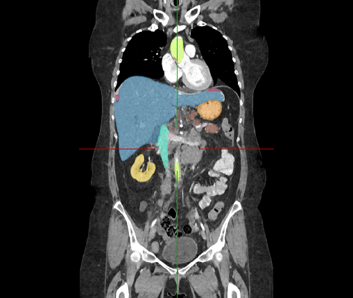
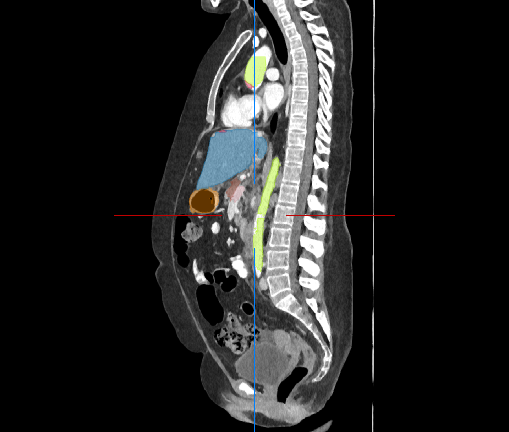

# CT Whole Body Segmentation Model

Tensorflow+Keras Abdominal CT Segmentation model trained on PancreasCT<sup>[1]</sup> and BTCV<sup>[2]</sup> datasets.

<p align="center">
  &nbsp;&nbsp;
  
  &nbsp;&nbsp;
  
  &nbsp;&nbsp;
  
  &nbsp;&nbsp;
  
  &nbsp;&nbsp;
</p>


### Run Model
```
usage: segmentbody3d.py [-h] [-i INPUT_FN] [-o OUTPUT_FN] [-m MODEL]
                        [-minW MIN_WINDOW] [-maxW MAX_WINDOW] [-iso]
                        [-p PATCH_SIZE] [-s STRIDE] [-v] [-b BATCH_SIZE]

Body Organ Segmentation for CT Images

optional arguments:
  -h, --help            show this help message and exit
  -i INPUT_FN, --input_fn INPUT_FN
                        Input CT Volume
  -o OUTPUT_FN, --output_fn OUTPUT_FN
                        Output Segmentation
  -m MODEL, --model_fn MODEL
                        Trained Model
  -minW MIN_WINDOW, --min_window MIN_WINDOW
                        Intensity Window minimum value
  -maxW MAX_WINDOW, --max_window MAX_WINDOW
                        Intensity Window maximum value
  -iso, --isotropic     Input Volume is Isotropic
  -p PATCH_SIZE, --patch_size PATCH_SIZE
                        3D Patch Division (patch)
  -s STRIDE, --stride STRIDE
                        3D Patch Division (stride)
  -v, --verbose         Verbose Output
  -b BATCH_SIZE, --batch_size BATCH_SIZE
                        Inference Batch Size

```


### Run Arguments

| arg        |                                                                                                                                                         |
|:-----------|:--------------------------------------------------------------------------------------------------------------------------------------------------------|
| input_fn   | Input nifti volume to be segmented (required)                                                                                                           |
| output_fn  | Output file name to save segmentation mask. If no name is provided, `_mask` will be appended to the input file name before extension (optional)         |
| model_fn   | Segmentation model file (required)                                                                                                                      |
| min_window | Minimum CT window level setting (default: -500 for provided model weights)                                                                              |
| max_window | Maximum CT window level setting (default: +500 for provided model weights)                                                                              |
| isotropic  | Use `--isotropic` flag if input volume is isotropic (default: False)                                                                                    |
| patch_size | Patch division for 'Sliding Window Inference'. Input volume is divided into smaller patches (sub-volumes) to satisify memory constraints (default: 128) |
| stride     | Stride for 'Sliding Window Inference'. Recommended `stride < patch_size` for patch overlap to avoid hard borders (default: 120)                         |
| verbose    | Use `--verbose` flag to print debug / progress messages to console (default: False)                                                                     |
| batch_size | Model inference batch size on patches (default: 4)                                                                                                      |


### Results

2 separate models were trained on PancreasCT and BTCV. 

```
# PancreasCT Train-Test Split
train = ['0002', '0003', '0004', '0005', '0006', '0007', '0008', '0009', '0010', '0011',
         '0012', '0013', '0014', '0016', '0017', '0018', '0019', '0020', '0021', '0022',
         '0024', '0026', '0027', '0028', '0029', '0030', '0031', '0032', '0033', '0034',
         '0035', '0038', '0039', '0040', '0041', 
eval  = ['0042', '0043', '0044', '0045', '0046', '0047', '0048']

# BTCV Train-Test Split
train = ['0001', '0002', '0003', '0004', '0005', '0006', '0007', '0008', '0009', '0010',
         '0021', '0022', '0023', '0024', '0025', '0026', '0027', '0028', '0029', '0030',
         '0031', '0032', '0033', '0034', '0035']
eval  = ['0036', '0037', '0038', '0039', '0040']
```

Dice Results on Evaluation Data:

|            |      |  Spl  | L.Kid | R.Kid | Gall  |  Eso  |  Liv  |  Sto  |  Aor  |  IVC  | Veins |  Pan  | R.AG  | L.AG  |
|:-----------|:----:|:-----:|:-----:|:-----:|:-----:|:-----:|:-----:|:-----:|:-----:|:-----:|:-----:|:-----:|:-----:|:-----:|
| PancreasCT | Mean | 0.949 |  ---  | 0.942 | 0.872 | 0.562 | 0.964 | 0.928 |  ---  |  ---  |  ---  | 0.738 |  ---  |  ---  | 
|            | Std  | 0.027 |  ---  | 0.017 | 0.030 | 0.176 | 0.009 | 0.013 |  ---  |  ---  |  ---  | 0.053 |  ---  |  ---  | 
| BTCV       | Mean | 0.867 | 0.925 | 0.930 | 0.624 | 0.418 | 0.924 | 0.799 | 0.817 | 0.753 | 0.554 | 0.722 | 0.164 | 0.191 | 
|            | Std  | 0.078 | 0.022 | 0.020 | 0.173 | 0.096 | 0.028 | 0.159 | 0.067 | 0.092 | 0.076 | 0.102 | 0.068 | 0.091 |


### Requirements

```
Python 3.7.11
```

### Packages

```
matplotlib==3.5.2
numpy==1.21.6
opencv-contrib-python-headless==4.6.0.66
opencv-python-headless==4.6.0.66
pandas==0.25.2
scikit-image==0.19.3
SimpleITK==2.1.1.2
tensorflow==2.9.1
tqdm==4.36.1
```

### References

```
[1] Roth HR, Farag A, Turkbey EB, Lu L, Liu J, and Summers RM. (2016). 
    Data From Pancreas-CT. The Cancer Imaging Archive. 
    http://doi.org/10.7937/K9/TCIA.2016.tNB1kqBU

[2] Landman BA, Xu Z, Igelsias JE, Styner M, Langerak TR, and Klein A, 
    "MICCAI multi-atlas labeling beyond the cranial vault - workshop 
    and challenge," 2015, https://doi.org/10.7303/syn3193805
```
